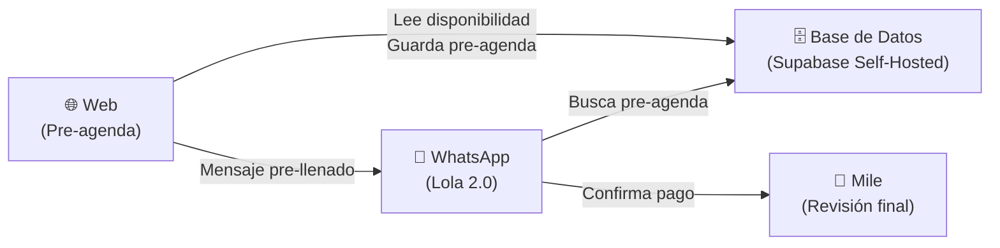
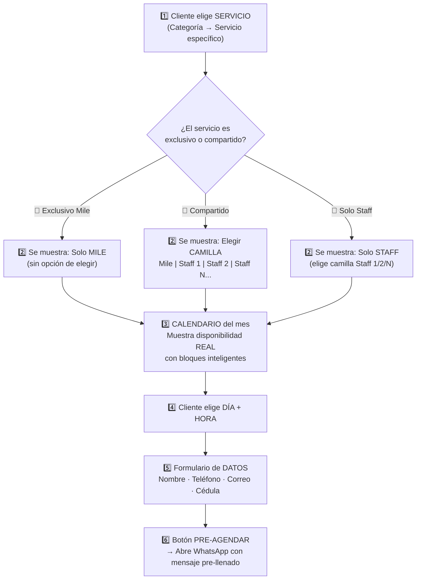
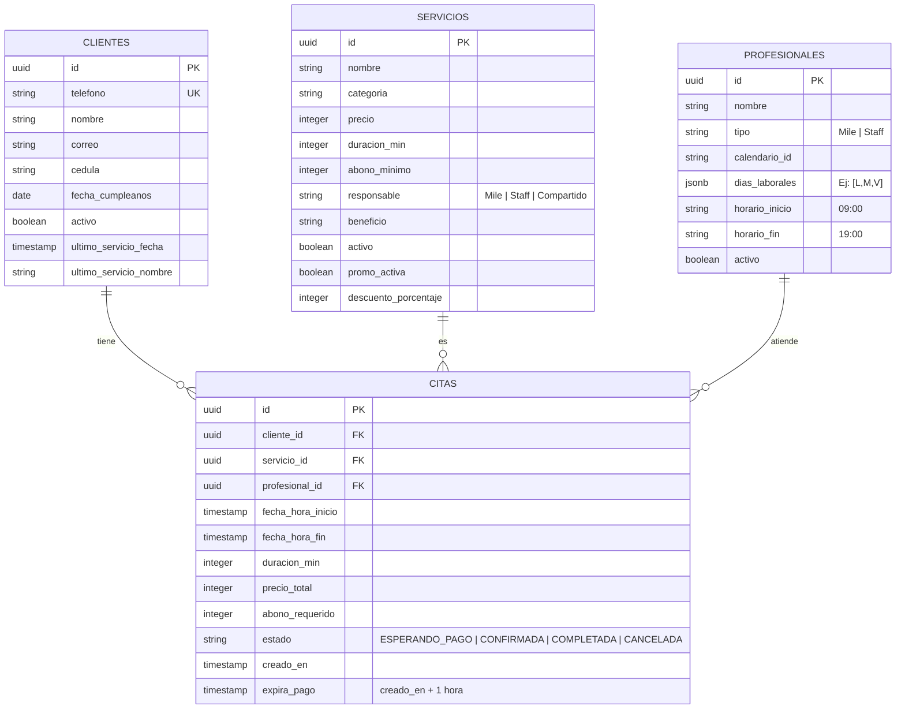
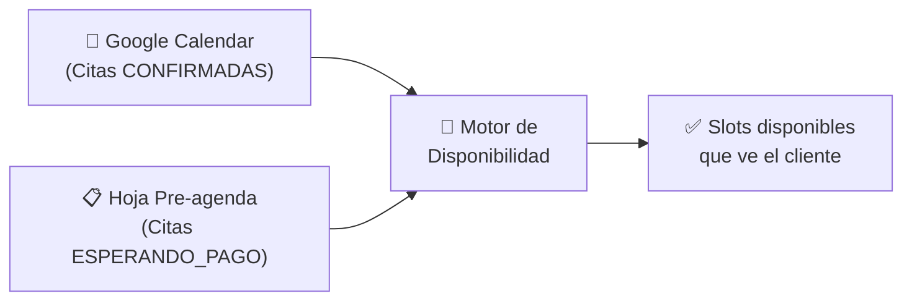

# 🧠 Lola 2.0 — Arquitectura del Sistema

## Visión General

El sistema se divide en **dos mundos que se comunican**:



---

## 🌐 Flujo de la Web (El nuevo motor de ventas)

La web reemplaza toda la "preguntadera" que hace Lola actualmente por WhatsApp. El cliente hace todo visualmente, rápido y sin fricción.

### Paso a paso del flujo:



### Detalles clave de cada paso:

#### 1️⃣ Selección de Servicio
- Mostrar categorías: Cejas, Pestañas, Faciales, Micropigmentación, Depilación, Corporal, Promos
- Al elegir categoría → ver servicios con **nombre, precio, duración**
- El precio ya viene con descuento aplicado si hay promo activa

#### 2️⃣ Selección de Profesional / Camilla
- Depende del servicio:
  - **Exclusivo Mile** → No se pregunta, se asigna automáticamente
  - **Exclusivo Staff** → Muestra camillas Staff disponibles (1, 2, ... N)
  - **Compartido** → Muestra TODAS las opciones: Mile + Staff 1 + Staff 2 + ... Staff N
- **Escalable:** Debe ser fácil agregar Staff 3, Staff 4, etc. desde la BD

#### 3️⃣ Calendario con Disponibilidad Real
> [!IMPORTANT]
> Este es el cerebro más complejo del sistema

- Muestra el **mes completo** con días disponibles/no disponibles
- Al elegir un día → muestra las **horas libres** de ESE profesional/camilla
- **Lógica de bloques inteligente:**
  - Cada servicio tiene distinta duración (9 min, 45 min, 120 min, etc.)
  - El sistema calcula cuántos bloques necesita
  - Organiza las citas **pegadas una detrás de otra** para maximizar el uso del tiempo
  - Ejemplo: Si Cejas dura 30 min y hay una cita a las 9:00-9:30, la siguiente slot disponible es 9:30, no 10:00

#### 4️⃣ Selección de hora
- El cliente ve SOLO las horas realmente disponibles (nada de "ese horario ya está ocupado")
- Si un día no tiene huecos suficientes para ese servicio, el día aparece bloqueado

#### 5️⃣ Datos del cliente (Facturación/CRM)
- **Nombre completo**
- **Teléfono** (número de WhatsApp)
- **Correo electrónico**
- **Cédula**
- Si el cliente está logueado → estos datos se auto-llenan

#### 6️⃣ Pre-agendar → WhatsApp
- El sistema guarda la pre-agenda en la BD con estado `ESPERANDO_PAGO`
- Abre WhatsApp con un **mensaje pre-llenado** tipo:
  ```
  Hola Lola 👋 Acabo de pre-agendar:
  📋 Servicio: Diseño + Henna
  👩 Con: Staff 1
  📅 Fecha: Viernes 16 de Mayo
  🕐 Hora: 10:30 AM
  💵 Total: $36.000 | Abono: $20.000
  ```

---

## 💬 Lola 2.0 (El nuevo rol: Asistente de Cobro y Soporte)

### ¿Qué HACE Lola 2.0?
| Función | Descripción |
|---|---|
| 📩 **Recibe pre-agendas** | Cuando el cliente llega con el mensaje pre-llenado, Lola busca su pre-agenda en la BD y le da los datos de pago |
| 💳 **Gestiona pagos** | Envía datos de Nequi/Daviplata, recibe comprobante, notifica a Mile |
| ❓ **Responde dudas** | Precios, horarios, ubicación, qué servicios hay (pero redirige a la web para agendar) |
| 🔄 **Redirige a la web** | "¡Para agendar más fácil, visita nuestra web! 🌐 [link]" |
| 🆘 **Solicita humano** | Casos especiales: cursos, tatuajes, retoques, bótox individual |
| 🎟️ **Rifa** | Si preguntan, da info y link |

### ¿Qué NO HACE Lola 2.0?
- ❌ NO agenda citas (eso lo hace la web)
- ❌ NO consulta disponibilidad (eso lo muestra la web en tiempo real)
- ❌ NO calcula precios (la web ya se los muestra al cliente)
- ❌ NO pregunta "¿con quién quieres?" ni "¿qué día?" (el cliente ya eligió todo en la web)

---

## 👤 Portal del Cliente (Login)

### Funcionalidades:
- **Login** con teléfono (WhatsApp) o correo
- **Ver mis citas:** Próximas y pasadas
- **Historial de servicios:** Qué se ha hecho, cuándo, con quién
- **Datos personales:** Editar nombre, correo, cédula
- **Estado de citas:** ESPERANDO_PAGO, CONFIRMADA, COMPLETADA

### CRM (Migración del Excel):
- Los datos actuales del Excel se migran a la tabla `clientes` en Supabase
- Campos: nombre, teléfono, correo, cédula, último_servicio, activo, fecha_cumpleaños

---

## 🗄️ Modelo de Base de Datos (Supabase Self-Hosted en VPS)



---

## 🔄 Lógica de Disponibilidad (El Cerebro)

> [!IMPORTANT]
> La disponibilidad se lee de **DOS fuentes**, NO de nuestra propia BD de citas.

### Las 2 fuentes de verdad:



| Fuente | Qué contiene | Cómo se consulta |
|---|---|---|
| **Google Calendar** | Citas ya confirmadas y pagadas (las reales) | API de Google Calendar con el `calendario_id` del profesional |
| **Hoja/Tabla Pre-agenda** | Citas pre-agendadas que aún no pagan (bloqueos temporales) | Se buscan por `calendario_id` del profesional solicitado |

### Cómo se calculan los slots disponibles:

```
1. Input: calendario_id (del profesional) + fecha + duracion_servicio
2. Obtener horario laboral del profesional (ej: 9:00 - 19:00)
3. CONSULTAR Google Calendar → obtener eventos confirmados de ese día
4. CONSULTAR Hoja Pre-agenda → obtener pre-agendas activas de ese día
5. COMBINAR ambas listas = todos los bloques "ocupados"
6. Generar bloques libres:
   - Recorrer desde hora_inicio hasta hora_fin
   - Saltar TODOS los bloques ocupados (confirmados + pre-agendados)
   - Solo mostrar un bloque si cabe la duración del servicio
7. Output: Array de horas disponibles [9:00, 9:30, 10:15, 14:00, ...]
```

> [!TIP]
> Los bloques se pegan consecutivamente. Si una cita termina a las 9:42, el siguiente slot empieza a las 9:42 (no a las 10:00). Esto maximiza la cantidad de citas por día.

### ¿Por qué dos fuentes y no solo la BD?
- **Google Calendar** es la fuente maestra que Mile ya usa y ve en su celular
- **La Pre-agenda** bloquea temporalmente el hueco mientras el cliente paga
- Si solo leyéramos Google Calendar, dos personas podrían pre-agendar la misma hora (porque la cita solo se escribe en Google Calendar DESPUÉS de que Mile confirma el pago)

### Auto-expiración de pre-agendas:
- Un **CRON JOB** corre cada minuto
- Si `estado = ESPERANDO_PAGO` y `NOW() > expira_pago` → Se elimina de la pre-agenda
- El slot vuelve a quedar libre automáticamente en la web

---

## 💳 Módulo de Pagos Escalables (Preparado para el futuro)

El sistema está diseñado desde su núcleo para ser **escalable** y soportar diferentes modelos de negocio sin reescribir el código. Se manejará mediante una tabla de configuración por empresa (`tenant`).

**Opciones activas en la arquitectura:**
1. **Flujo Manual (Nequi/Daviplata):** El cliente pre-agenda en la web, recibe los datos por WhatsApp (Lola), envía la foto del comprobante y Mile confirma manualmente. *(Este será el primer flujo a implementar para Milé).*
2. **Flujo Pasarela Automática (MercadoPago/Wompi):** El cliente paga directamente en la web. La pasarela envía un *Webhook* al servidor (Supabase) y la cita pasa automáticamente a `CONFIRMADA`. Lola solo envía el mensaje de éxito.

---

## 🖥️ Dashboard de Administración (Mile's Control Center)

El Dashboard reemplaza **las 5 hojas de Excel** por una interfaz visual que Mile (o quien administre el negocio) pueda manejar sin ser técnica. Es la "trastienda" del sistema.

### Módulos del Dashboard

#### 1. 👥 Gestión de Profesionales / Staff (tu Excel: `config_general`)
- Agregar nuevo Staff: nombre, foto, tipo (Mile/Staff), `calendario_id` de Google Calendar
- Definir horario de atención **por profesional** (puede variar — una trabaja de 9 a 5, otra de 12 a 8)
- Activar / Desactivar profesional (si alguien renuncia, no se borra, se desactiva)
- **Escalable:** Agregar Staff 3, Staff 4, Staff N es solo un registro nuevo en esta pantalla

#### 2. 🕐 Gestión de Horarios (tu Excel: `horarios`)
- Definir por cada profesional: días laborales + hora inicio + hora fin
- Manejar **días especiales:** festivos, vacaciones, cierres temporales
- Ejemplo: Mile trabaja Lun/Mié/Vie 9am-7pm. Staff trabaja Mar/Jue/Sáb 8am-6pm

#### 3. 💄 Gestión de Servicios (tu Excel: `servicios`)
- CRUD completo: agregar, editar, desactivar servicios
- Campos: nombre, categoría, precio, duración (minutos), abono mínimo, responsable (Mile/Staff/Compartido), beneficio
- **Activar/desactivar promociones** con % de descuento y fechas de vigencia
- Sin tocar n8n ni el prompt del bot — Lola 2.0 lee directo de la BD

#### 4. 💰 Gestión de Pagos / Finanzas (tu Excel: `pagos`)
- Ver todos los pagos recibidos (comprobantes, montos, fechas)
- Estado: Pendiente de verificar / Verificado / Rechazado
- Confirmar o rechazar comprobantes manualmente
- Resumen financiero: ingresos del día/semana/mes
- Configurar: ¿Flujo Manual (Nequi) o Pasarela Automática?

#### 5. 🧑‍🤝‍🧑 Gestión de Clientes / CRM (tu Excel: `clientes`)
- Ver todos los clientes con sus datos de facturación
- Ver último servicio, fecha, si es cliente activo
- Historial completo de citas por cliente
- **Migración:** Importar el Excel actual con un botón (CSV → BD)

#### 6. 📋 Pre-agenda en Tiempo Real (tu Excel: `preagenda`)
- Ver las pre-agendas activas ahora mismo y cuánto tiempo les queda
- Ver las que expiraron
- Cancelar manualmente si Mile necesita liberar un espacio urgente

#### 7. 💆 Tratamientos VIP (tu Excel: `tratamientos`)
- Ver los packs activos de cada cliente (Faciales, Láser, Hidralips)
- Cuántas sesiones le quedan, cuándo fue la última, saldo pendiente
- Agendar sesiones de seguimiento manualmente si es necesario

#### 8. ⚙️ Configuración General (tu Excel: `config_general`)
- Datos del negocio: nombre, teléfono, ubicación, Instagram, link de Maps
- Números de pago: Nequi, Daviplata, titular
- Recargo de tarjeta (%)
- Activar/desactivar rifa, promo activa, mensaje de bienvenida de Lola

---

### ¿Quién accede al Dashboard?
| Rol | Acceso |
|---|---|
| **Dueña (Mile)** | Todo: configuración, pagos, clientes, finanzas |
| **Administrador** | Todo excepto configuración avanzada |
| *(Futuro) Staff* | Solo ver su agenda del día |

---

## 📋 Pendientes por definir
- [ ] Diseño de la web pública (cuando llegue la inspiración)
- [ ] Diseño del Dashboard de administración
- [ ] Cancelación y cambio de hora (¿desde la web? ¿desde WhatsApp?)
- [ ] Notificaciones (¿recordatorios por WhatsApp antes de la cita?)
- [ ] Tratamientos VIP (packs de múltiples sesiones)
- [ ] Stack técnico: ¿Next.js? ¿Vite? ¿HTML puro?
- [ ] Migración de datos del Excel actual a Supabase
